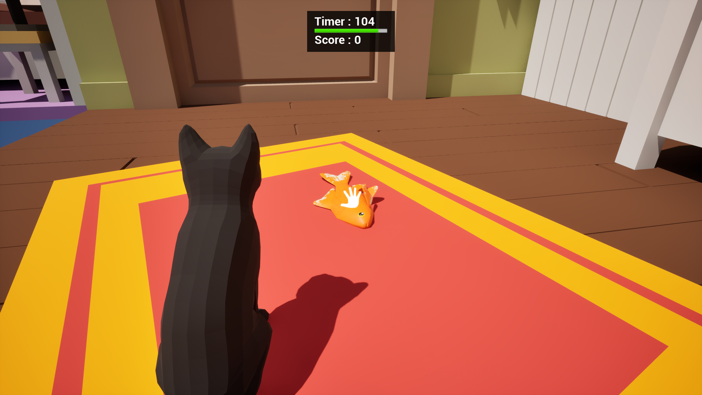

# 【LeaveTheRoom】
***阅读中文文档 >[中文](README.md)***\
***日本語のドキュメントを読む >[日本語](README_ja.md)***\
***Read this document in >[English](README_en.md)***

## 【Project Introduction】
This is a demo game project developed using Unreal Engine 5.4.4.\
The player controls a cat, moving between multiple rooms through "portals" to find "fish" and gain points. The objective is to leave the room through the "exit door" within the time limit to win!

## 【操作方式】
WSAD or Arrow Keys: Movement\
Mouse Movement: Rotate the camera\
Mouse Click: Click on the fish to gain points\
Mouse Hold: Hold the mouse on the "portal" or "exit door" to use them\
Spacebar: Jump\
Hold Left Shift: Slow movement

## 【Project Development Details】
Developed using Unreal Engine 5.4.4, this project is built upon the Gameplay framework. C++ is used for core framework and plugin development, while Blueprints are used for implementing business logic.

### C++
1. Developed custom functional classes such as GameActor at the core level to create an additional abstraction layer between the business logic and Unreal Engine, making future expansion and maintenance easier.
2. DetectionSystem: A detection system based on EQS to search for necessary targets in the environment.
3. BlurFengLibrary: A general-purpose math and methods library for the project.

### Project Assets and Blueprints
#### Plugins
1. DetectionSystem: A debug UMG is provided via Blueprints, along with a demo scene showcasing a standalone plugin feature.
#### Project Details
1. Separated the business logic into GameMode, GameState, PlayerController, and Character based on the UE Gameplay framework.
2. Implemented player input functionality using the new Enhanced Input system.
3. Developed a character animation state machine that changes according to movement states.
4. Created core gameplay classes, such as the InteractionActor base class and its subclasses, TeleportDoor, ExitDoor, and ScoreItem.
5. Developed configuration files and EQS assets for the DetectionSystem as required by the business logic.
6. Rooms are automatically generated based on configuration files, including TeleportDoor, ExitDoor, ScoreItem, and AirWallBox. The system allows flexible configuration for easy content production.
7. UI: Built the main project UI and control prompt UI using UMG.

## 【Others】
Game assets are sourced from the UE Marketplace.

## 【TODO】
1. Currently, there are only 13 configured rooms.
2. A tool for visualizing the room configuration file still needs to be developed.