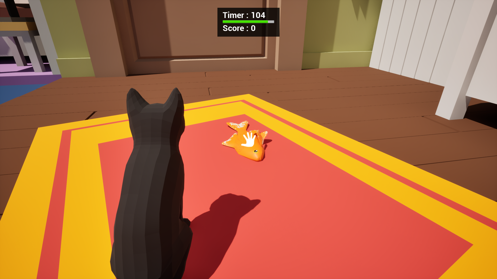
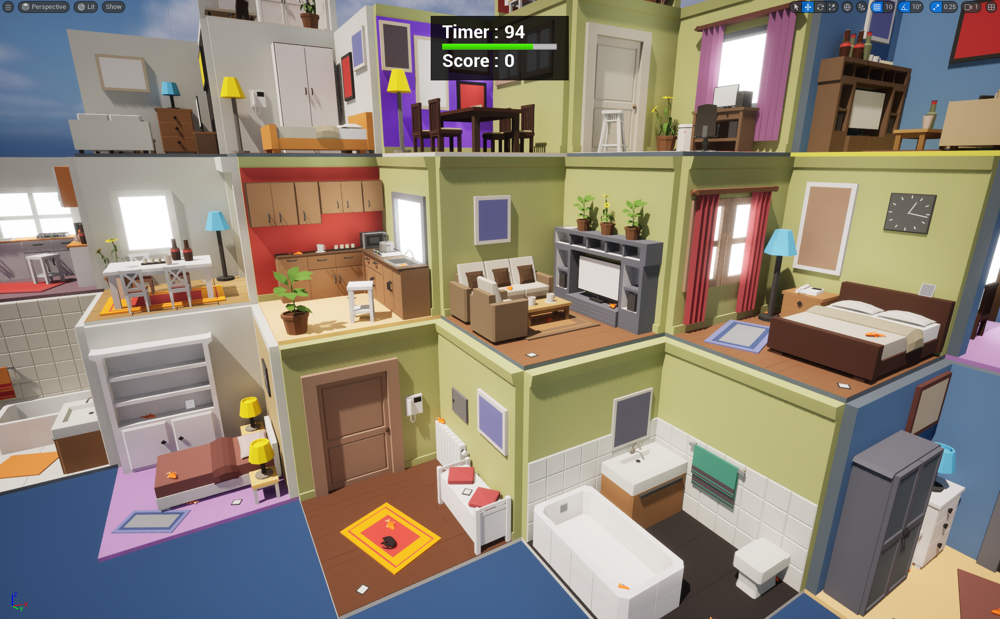

# 【LeaveTheRoom】
***阅读中文文档 >[中文](README.md)***\
***日本語のドキュメントを読む >[日本語](README_ja.md)***\
***Read this document in >[English](README_en.md)***

## 【プロジェクト紹介】
Unreal Engine 5.4.4バージョンを使用して開発されたデモ用のゲームプロジェクトです。\
プレイヤーは猫を制御し、複数の部屋を「ポータル」で移動しながら「魚」を探してポイントを獲得します。制限時間内に「出口ドア」から部屋を出ると勝利します！

## 【操作方法】
WSAD または 方向キー: 移動\
マウス移動: カメラの回転\
マウスクリック: 魚をクリックしてポイントを獲得\
マウス長押し: 「ポータル」や「出口ドア」を使用する\
スペースキー: ジャンプ\
Left Shift押しっぱなし: ゆっくり移動

## 【プロジェクト開発内容】
Unreal Engine 5.4.4を使用し、Gameplayフレームワークに基づいて開発しました。C++で基盤コードや機能プラグインを作成し、ブループリントでビジネスロジックを実装しています。

### C++
1. プロジェクトの基盤としてプロジェクトのGameActorクラスなどを構築し、エンジンとビジネス層の間に抽象レイヤーを追加。これにより将来的な拡張とメンテナンスが容易になります。
2. DetectionSystem（探索システム）：EQSを基に、必要なターゲットを検索するシステムを開発。
3. BlurFengLibrary：共通の数値計算やメソッドを集めたライブラリ。

### プロジェクトのアセットおよびブループリント
#### プラグイン
1. DetectionSystem：ブループリントでデバッグ用UMGと、単体機能のデモシーンを提供。
#### プラグインとブループリント
1. Gameplayフレームワークに基づき、GameMode、GameState、PlayerController、Characterにビジネスロジックを分離。
2. Enhanced Inputを用いてプレイヤー入力機能を制作。
3. 状態に応じたキャラクターのアニメーション状態機を作成。
4. 主要なゲームプレイクラス。InteractionActor基底クラス、サブクラスのTeleportDoor、ExitDoor、ScoreItemを制作。
5. DetectionSystem用の設定ファイルとEQSアセットを作成。
6. 部屋の内容は設定ファイルを元に自動生成されます。TeleportDoor、ExitDoor、ScoreItem、AirWallBoxが含まれ、設定ファイルにより柔軟な構成が可能。
7. UMGを用いてメインUIと操作案内のUIを構築。

## 【その他】
ゲームのリソースはUEマーケットプレイスから取得しています。

## 【TODO】
1. 現在、部屋の設定は13個の部屋のみ。
2. 部屋の設定ファイルを視覚化するツールが未完成。